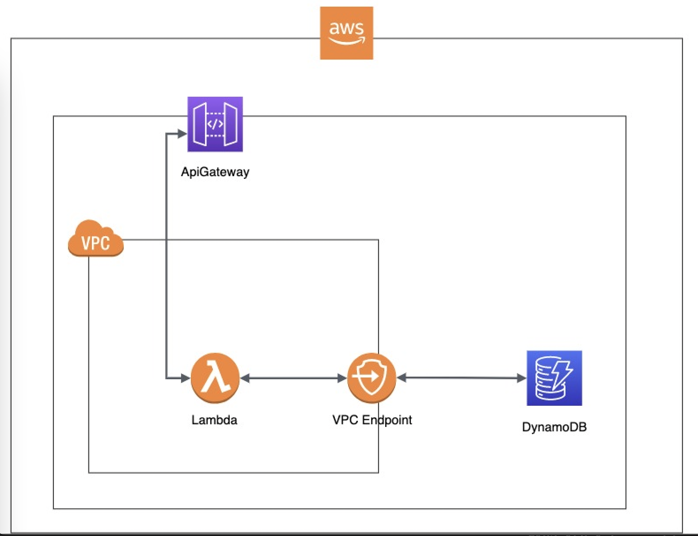

# scrumblr-sam-api

This repository is backend microservice of the frontend repository called [scrumblr-enhancement](https://github.com/zainafzal88/scrumblr-enhancement)

## Overall Project Idea

[scrumblr-enhancement](https://github.com/zainafzal88/scrumblr-enhancement) and this repository will be the enhanced version of the existing open source project [Scrumblr](http://scrumblr.ca/) as it will contain persistent storage, run on Amazon Web Services (AWS) with architectural security features implemented.

## Technologies Used
* Express.js
* AWS Serverless Application Model (SAM incorporates API Gateway, Lambda and DynamoDB) 
* AWS Virtual Private Cloud (VPC)
* AWS VPC Endpoint
* Fetch API
* Postman

## Programming Languages

* Node.js

## Architecture

## For External Collaborators

If anyone except the current team would like to collaborate, please follow the below procedure

1. Clone the repository
2. Create your own branch
3. Implement your change following best practices
4. Create a pull request to `dev` branch
5. Add a detailed description of
   * What was wrong or needed adding and why
   * What did you do
6. Assign the pull request for review to zainafzal88

If your changes are considered appropriate, they will be merged otherwise, you will contacted.
